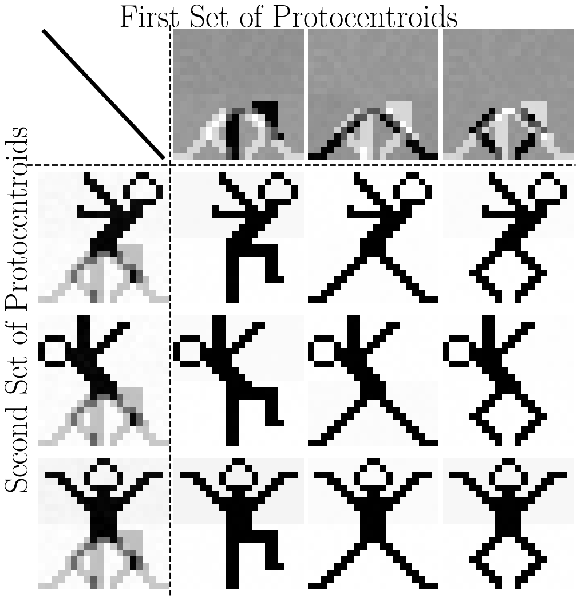

# Khatri-Rao Clustering

This code implements the Khatri-Rao clustering algorithms introduced in the paper "Khatri-Rao Clustering for Data Summarization". 
The code is written in Python 3. 

Khatri-Rao clustering is a paradigm extending existing prototype-based clustering algorithms to achieve higher compression rates and Khatri-Rao clustering algorithms find more concise yet equally accurate dataset reparameterization compared to standard clustering algorithms. 




## 🔧 Install
- Create Conda environment:  
  ```bash
  conda env create -f kr.yml
  ```


## 📁 Repository contents 
- `KathriRaokMeans/`
   - `kr_k_means.py`: implements the Khatri-Rao k-means algorithm. 
   - `kr_k_means_utils.py`: utilities for the Khatri-Rao k-means algorithm.

- `KhatriRaoDeepClustering/`
  - `kr_dkm.py`: implements the Khatri-Rao DKM deep clustering algorithm. 
  - `kr_idec.py`: implements the Khatri-Rao IDEC deep clustering algorithm.
  - `deep_clustering_utils.py`: utilities for Khatri-Rao deep clustering algorithms.

- `Scripts/`
  - `run_k_means_experiments.py`: run experiments comparing standard and Khatri-Rao k-means clustering.
  - `run_deep_clustering_experiments.py`: run experiments comparing standard and Khatri-Rao deep clustering.
  - `run_experiments_utils.py`: general utilities for all experiments.
  - `KRkmeansExperimentsLib.py`: utilities for k-means experiments.
  - `KRDeepExperimentsLib.py`: utilities for deep clustering experiments.

- 📎`Appendix.pdf`: appendix containing additional dataset descriptions, implementation details and additional technical details.

## ✏️ Minimal example
```python
from kr_k_means import KrKMeans
X = np.random.randn(250, 2) # Full-rank 250 x 250 matrix with i.i.d standard gaussian entries
n_protocentroids_set_1, n_protocentroids_set_2 = 3, 3
kr_kmeans = KrKMeans(X, n_protocentroids_set_1, n_protocentroids_set_2, operator=operator)
_, kr_k_means_loss, _ = kr_kmeans.fit(n_iter=100, init_type="random", th_movement=0.0001)
print(f"The inertia of the clustering solution with two sets of {n_protocentroids_set_1} and {n_protocentroids_set_2} protocentroids is {kr_k_means_loss}")
```

## 📚 Datasets

The datasets used in the experiments are available through the following open-source Python libraries:
- **[scikit-learn](https://scikit-learn.org/stable/datasets.html)**
- **[ClustPy](https://clustpy.readthedocs.io/)** 
- **[ClustBench](https://clustering-benchmarks.gagolewski.com/)** 

All ClustPy datasets are fetched automatically at runtime.
On the other hand, for the <small><b>r15</b></small> and <small><b>chameleon</b></small> datasets that are available in ClustBench, one needs to [download](https://github.com/gagolews/clustering-data-v1/releases/tag/v1.1.0/) the Benchmark Suite (v1.1.0) repository onto their own disk and place it within the `Scripts/` folder.  
